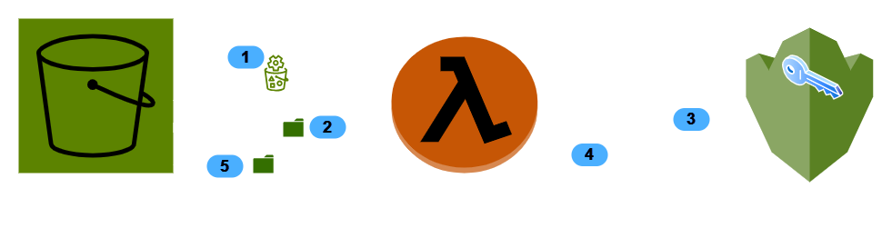

# c2pa aws lambda sign demo with aws kms

## Setup AWS KMS for private key import

1. convert private key in binary format (.der)
 ``
openssl pkcs8 -topk8 -inform PEM -outform DER -in es256_private.key -out es256_private.der -nocrypt
``
Now we have private key `es256_private.der`
2. Create KMS Key with:
``
aws kms create-key --key-spec ECC_NIST_P256 --key-usage SIGN_VERIFY --origin EXTERNAL
``
Check for output, please write down KeyId (needed for next steps)

3. Navigate to AWS KMS Console and choose appropiate Key with given KeyId (see 3.)
 - Navigate to "Key Material" and choose "Import key material".
 - Choose wrapping key spec `RSA_4096` and wrapping algorithm `RSAES_OAEP_SHA_256`
 - Click on "Download wrapping public key and import token"
 - You will download a ZIP File containg both wrapping public key and import token
 - Get `WrappingPublikKey.bin` from ZIP and ...
4. Encrypt private key `es256_private.der` (see 1.) with Wrappingpublickey (see.3)
```
openssl pkeyutl \
    -encrypt \
    -in es256_private.der \
    -out EncryptedKeyMaterial.bin \
    -inkey WrappingPublicKey.bin \
    -keyform DER \
    -pubin \
    -pkeyopt rsa_padding_mode:oaep \
    -pkeyopt rsa_oaep_md:sha256 \
    -pkeyopt rsa_mgf1_md:sha256
```
5. Now let's import the encrypted Key Material with given KeyID and ImportToken and "valid-to" Timestamp
```
aws kms import-key-material \
    --key-id <KeyId> \
    --encrypted-key-material fileb://EncryptedKeyMaterial.bin \
    --import-token fileb://ImportToken.bin \
    --expiration-model KEY_MATERIAL_EXPIRES \
    --valid-to 2025-09-21T19:00:00Z

```
5. Now KMS with Key is ready to use:-)

#### Pre-requistes
https://docs.aws.amazon.com/serverless-application-model/latest/developerguide/prerequisites.html

## Deployment of Application via AWS SAM
Check out repository
```
cd lambda_c2pasign
sam build
sam deploy --guided
```
Once you define `KMS Key ID of used KMS Signer Key`, please use KeyId of previously created KMS Key.

## Short Introduction in running c2patool with AWS KMS



1. There's a trigger configured, that once an Object on S3 Bucket has been created in folder "s3BucketPath" (defined by env-variable, default "data"), a call to Lambda function will be initiated. (ref https://github.com/nitrat7/c2pa_sign_awslambdakms/blob/4a185dc5502490e891a8de1c4f493726f3b01be6/lambda_c2pasign/Function.cs#L35)
2. Lambda Function will download Object to local Store 
3. Starting Signing with given manifest-definition, ref. https://github.com/nitrat7/c2pa_sign_awslambdakms/blob/4a185dc5502490e891a8de1c4f493726f3b01be6/lambda_c2pasign/runC2PA.cs#L201 
To be signed claim-bytes will be sent to AWS KMS  - and with stored Config with private Key on AWS KMS, ref. https://github.com/nitrat7/c2pa_sign_awslambdakms/blob/5e1dba2854ee944168bae40f11f6891545c34cc6/kms_signer/Program.cs#L1 <br>
Have a look using parameter `signer-path`,  ref. https://github.com/nitrat7/c2pa_sign_awslambdakms/blob/5e1dba2854ee944168bae40f11f6891545c34cc6/lambda_c2pasign/runC2PA.cs#L208 and https://github.com/contentauth/c2patool?tab=readme-ov-file#signing-claim-bytes-with-your-own-signer
4. the signed claim bytes will be returned
5. the signed Object will be transferred back to S3-Bucket  in folder "s3BucketPathSigned" (defined by env-variable, default "data_sign")
